# Rapport d'Attaque — SMART FISHING

## Suivi des pêches artisanales et sécurité des pêcheurs en Côte d'Ivoire

---

## 1. Introduction

Ce rapport documente les 4 attaques réseau simulées sur l'infrastructure Smart Fishing. L'objectif est de prouver les vulnérabilités du système sans sécurité, puis de valider l'efficacité des contre-mesures (TLS, authentification, ACL).

---

## 2. Environnement de test

| Composant | Détail |
|-----------|--------|
| Broker | Mosquitto 2.0.11 |
| Port vulnérable | 1883 (accès anonyme, pas de TLS) |
| Port sécurisé | 8883 (TLS 1.2, authentification) |
| Système | Ubuntu 22.04 (WSL2) |
| Langage | Python 3 (paho-mqtt) |

## 2.1 Lancement du Brocker Vulnerable

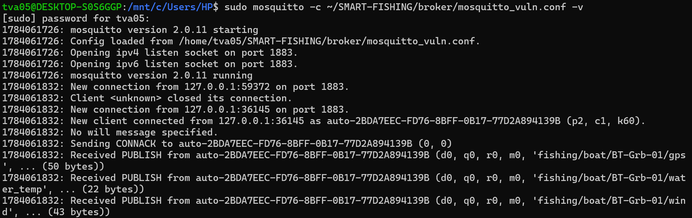

Le broker est démarré avec la configuration `mosquitto_vuln.conf`, qui autorise les connexions anonymes sur le port 1883 sans aucun chiffrement. Cette configuration expose l'intégralité du trafic MQTT en clair, permettant à un attaquant sur le même réseau de capturer et lire toutes les données échangées.

---

Nous allons maintenant simuler les 4 attaques sur le broker vulnérable (port 1883) pour identifier les failles de sécurité.

## 3. Attaque 1 — Sniffing (interception passive)

### Description

Le sniffing consiste à écouter passivement le trafic réseau pour intercepter les données transmises, sans interaction avec les parties légitimes.
Le script se connecte au broker vulnérable (port 1883) et s'abonne à l'ensemble des topics (#), affichant en clair chaque message intercepté.

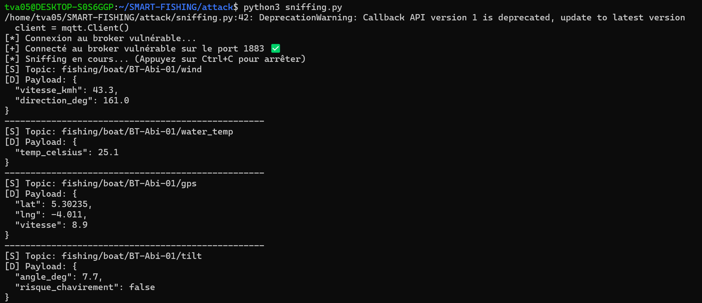

⚠️ Vulnérabilité exploitée : Absence de chiffrement du canal de transport (pas de TLS sur le port 1883). Toute donnée capteur (position GPS, température, inclinaison, captures) est lisible en clair par quiconque peut observer le trafic réseau, sans avoir besoin d'identifiants ni de casser un quelconque mécanisme de sécurité.

### 4. Attaque 2 — Spoofing (usurpation de capteur)
Description
Le spoofing consiste à se faire passer pour un capteur légitime et à publier de fausses données directement sur un topic existant, sans avoir besoin d'intercepter le moindre trafic réel.

### 4.1 Spoofing du capteur de température

bash
python3 spoofing.py

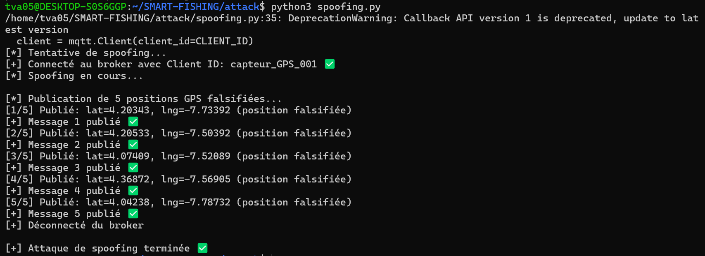

Le script se connecte au broker avec un Client ID usurpé (capteur_TEMP_001) et publie 5 messages de gps anormale avec une alerte critique, sans qu'aucune vérification d'identité ne soit requise par le broker.

### 4.2 Généralisation — Spoofing de la position GPS

Afin de démontrer que la vulnérabilité ne se limite pas au capteur de température, une seconde attaque a ciblé le capteur GPS, avec un Client ID usurpé (capteur_GPS_001) publiant 5 positions falsifiées hors de la zone de pêche habituelle, avec une vitesse quasi nulle simulant un bateau à la dérive.

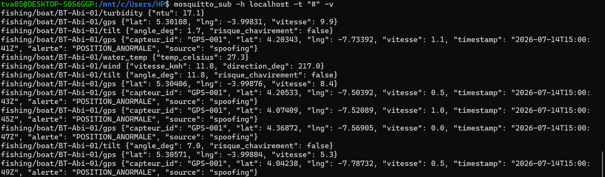

les positions GPS falsifiées (capteur_id: GPS-001, alerte: POSITION_ANORMALE) s'intercalent avec les positions GPS légitimes du bateau

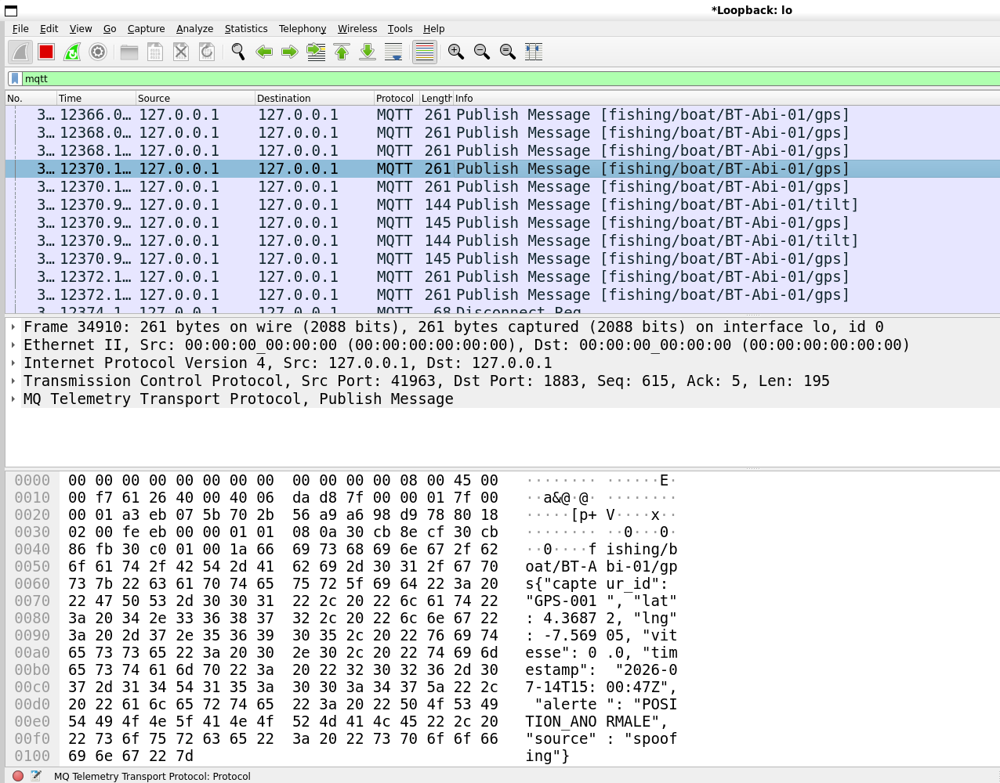

⚠️ Vulnérabilité exploitée : Absence d'authentification par capteur/client sur le broker : n'importe quel client peut se connecter con un Client ID arbitraire et publier sur n'importe quel topic, sans certificat ni identifiant vérifié. Le broker ne fait aucune distinction entre un message provenant d'un capteur réel et un message injecté par un attaquant.

### 5. Attaque 3 — Replay (rejeu de message)

Description
Le rejeu consiste à capturer un message légitime déjà transmis, puis à le renvoyer tel quel ultérieurement pour qu'il soit accepté comme une donnée nouvelle.

Script utilisé
bash
python3 replay.py replay

Le script capture un message légitime sur le topic water_temp, le sauvegarde, puis le rejoue 5 fois d'affilée sur le même topic.

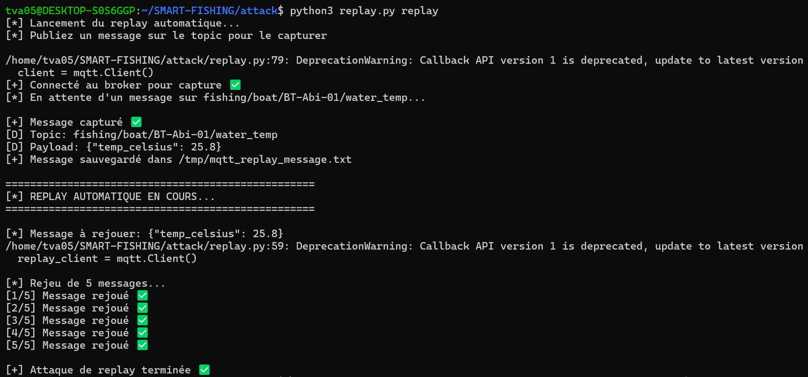

Capture d'un message légitime ({"temp_celsius": 25.8}) puis rejeu automatique de 5 copies identiques

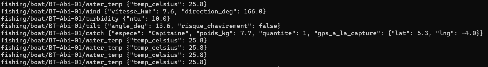

5 messages strictement identiques injectés dans le flux

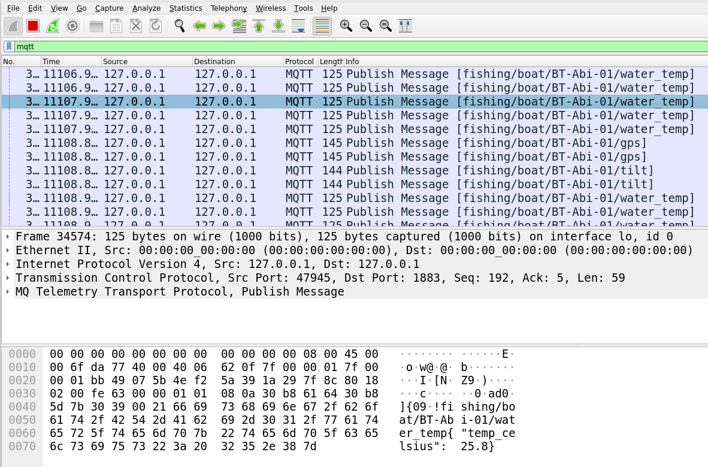

⚠️ Vulnérabilité exploitée : Absence de mécanisme anti-rejeu : ni le broker ni le format des messages capteurs n'incluent de nonce unique ou de vérification de fraîcheur (timestamp validé côté broker/dashboard).

### 6. Attaque 4 — Man-in-the-Middle (interception active)
Description
L'attaque MITM consiste à s'interposer entre les capteurs et le broker via un proxy TCP transparent, afin de modifier les données en transit en temps réel.

Script utilisé
bash
python3 mitm.py
Le proxy écoute sur le port 1884 et relaie vers le broker sur le port 1883. Il intercepte chaque message contenant temp_celsius, augmente la valeur de 10°C, ajoute un indicateur mitm: true, et déclenche une alerte CRITIQUE si le nouveau seuil dépasse 30°C.

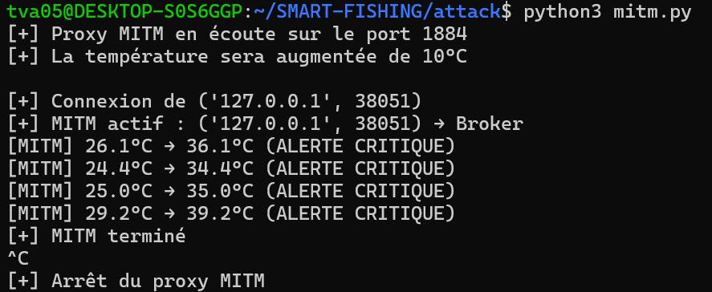

Sortie du proxy MITM : température interceptée et augmentée de 10°C en temps réel

Résultat observé

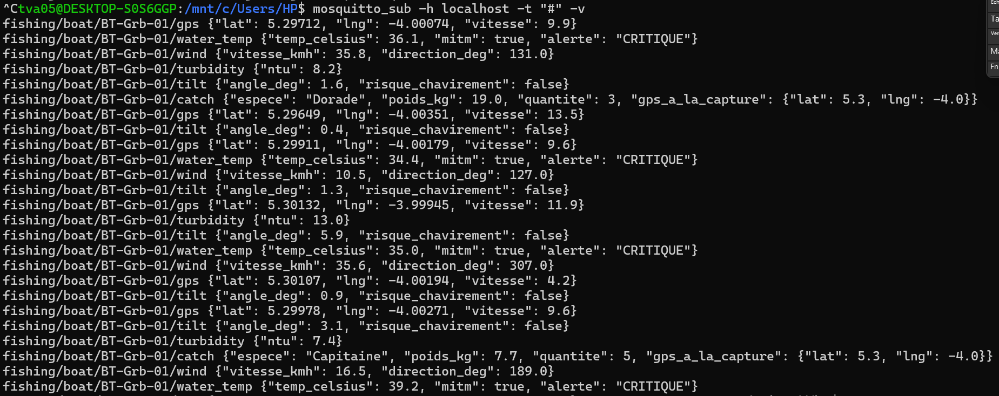

les messages water_temp sortent modifiés avec mitm: true et alerte: CRITIQUE

⚠️ Vulnérabilité exploitée : Absence de chiffrement de bout en bout et d'authentification mutuelle (mTLS) entre les capteurs et le broker. Un attaquant positionné entre le client et le broker peut lire et modifier les données à la volée sans être détecté.

### 7. Contre-mesure — Broker sécurisé (TLS + authentification)

Description

Afin d'évaluer l'efficacité d'un durcissement de sécurité, les mêmes conditions de test ont été reproduites sur la configuration sécurisée du broker (port 8883, TLS 1.2 avec certificats X.509, authentification par identifiants).

# Démarrage du broker sécurisé

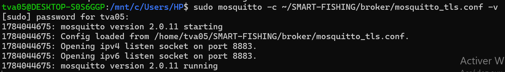

Démarrage de Mosquitto avec la configuration TLS (mosquitto_tls.conf), écoute sur le port 8883

# Blocage d'un accès non authentifié

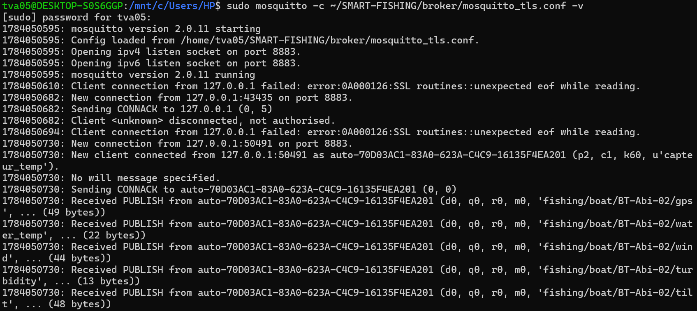

Le simulateur de capteurs se voit refuser l'accès sans mot de passe valide (code retour 5), puis se connecte et publie normalement une fois authentifié

#Sniffing bloqué par le chiffrement TLS

La même capture Wireshark, reproduite sur le port 8883, ne révèle plus aucun contenu exploitable : le protocole apparaît comme TLS et le contenu comme Application Data chiffrée, illisible pour un attaquant en écoute passive.	

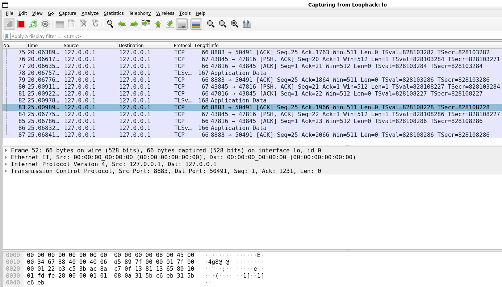

Capture Wireshark sur le port 8883 : trafic chiffré (TLSv1.2/1.3, Application Data) — aucun topic ni payload n'est lisible

## 9. Conclusion

Les quatre scénarios d'attaque menés sur le broker MQTT non sécurisé (port 1883) ont tous abouti :

- 🔴 **Sniffing** : interception en clair des données capteurs
- 🔴 **Spoofing** : injection de fausses données sous une identité usurpée
- 🔴 **Replay** : rejeu de messages authentiques
- 🔴 **MITM** : falsification en temps réel via un proxy

Ces résultats confirment qu'un broker MQTT déployé **sans TLS ni authentification** expose l'intégralité du système Smart Fishing à des risques opérationnels concrets : fausses alertes critiques, falsification de position de bateau, ou masquage d'une situation de détresse réelle.

La configuration durcie testée (TLS + authentification par identifiants) bloque efficacement le sniffing et les connexions non autorisées, confirmant la pertinence de cette contre-mesure.

Il reste toutefois recommandé de compléter ce dispositif par :

- 🔒 **Authentification mutuelle par certificat (mTLS)**
- 🔒 **Listes de contrôle d'accès (ACL) strictes** par topic et par capteur
- 🔒 **Mécanisme anti-rejeu** (nonce, timestamp)

Afin de couvrir l'ensemble des vecteurs d'attaque démontrés dans ce rapport.

---

**Rapport rédigé par :** RIST 1 — Chef de projet & Sécurité  
**Date :** 14/07/2026  
**Version :** 1.0
