# Rapport d'Attaque — SMART FISHING

## Auteur
**RIST 1** — Chef de projet & Sécurité : TOURE ALPHA MAMOUD

## Date
03/07/2026

---

## 1. SNIFFING MQTT

Le sniffing consiste à écouter passivement le trafic réseau qui circule entre les capteurs et le broker MQTT.
L'attaquant utilise un outil (ici un script Python) qui s'abonne à tous les topics MQTT (wildcard #).
Sans authentification, il peut lire toutes les données en clair.

### Broker vulnérable
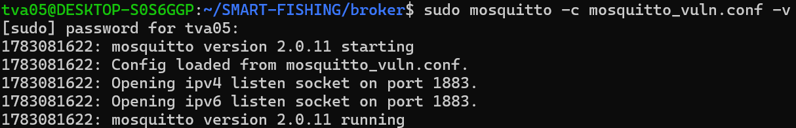

### Attaque en cours
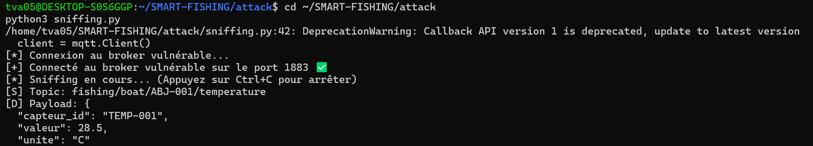

### Message capturé
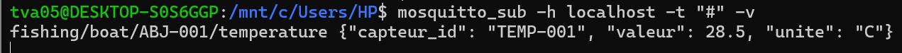

### Message publié
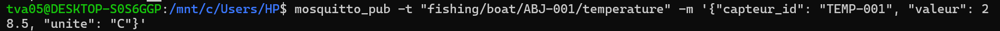

### Preuve

[+] Connecté au broker vulnérable sur le port 1883 ✅
[S] Topic: fishing/boat/ABJ-001/temperature
[D] Payload: {
    "capteur_id": "TEMP-001",
    "valeur": 28.5,
    "unite": "C"
}

### Impact

Les données sensibles (température, GPS, captures) sont exposées
L'attaque est passive → aucune trace dans les logs
L'attaquant peut espionner l'activité de pêche en temps réel

-------------------------------------------------------------------------------------------------------------------

## 2. SPOOFING (Usurpation d'identité)

Le spoofing consiste à usurper l'identité d'un capteur légitime pour publier de fausses données. 
L'attaquant se connecte au broker avec le Client ID d'un capteur réel. Le broker accepte la connexion et déconnecte le capteur légitime (car MQTT n'autorise qu'un seul client par ID).

### Attaque en cours
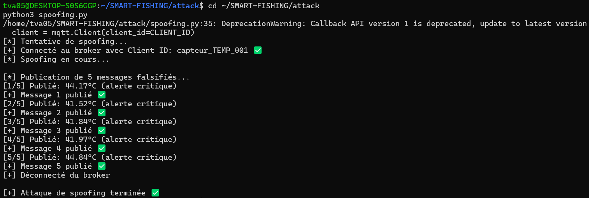

### Message capturé
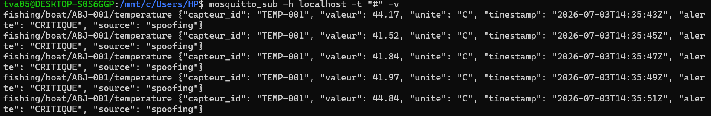

### Message publié
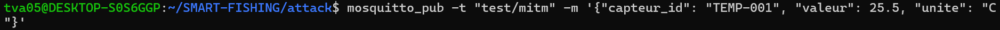

### Preuve

[*] Connecté au broker avec Client ID: capteur_TEMP_001 ✅
[1/5] Publié: 44.17°C (alerte critique)
[2/5] Publié: 41.52°C (alerte critique)
[3/5] Publié: 41.84°C (alerte critique)
[4/5] Publié: 41.97°C (alerte critique)
[5/5] Publié: 44.84°C (alerte critique)

### Impact

Injection de fausses données (températures anormales)
Falsification des statistiques de pêche
Déclenchement de fausses alertes
Le capteur légitime est déconnecté sans avertissement

-------------------------------------------------------------------------------------------------------------------

## 3. REPLAY (Rejeu de messages)

Le replay consiste à capturer un message légitime, puis à le rejouer plusieurs fois pour fausser les données.
L'attaquant capture un message MQTT (ex: température 28.5°C)
Il sauvegarde le message
Il le rejoue 5 fois (ou plus) sur le broker

### Attaque en cours
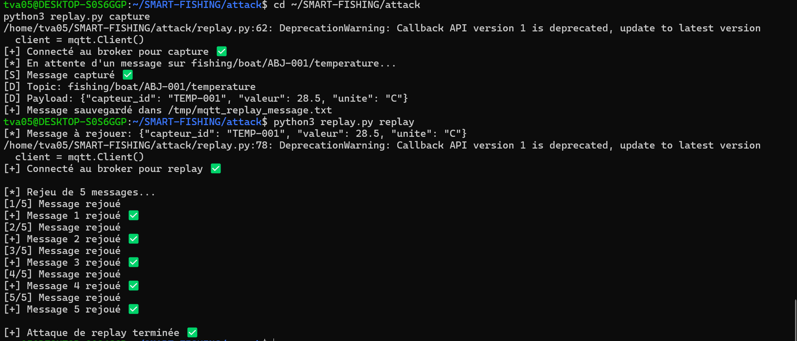

### Message capturé
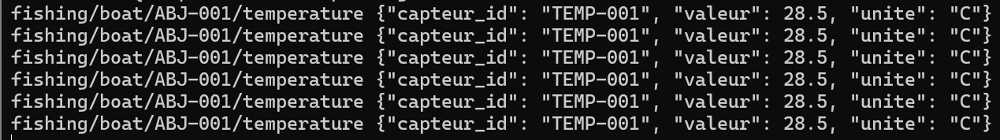

### Message publié
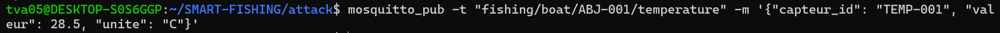

### Preuve

[+] Message capturé ✅
[D] Payload: {"capteur_id": "TEMP-001", "valeur": 28.5, "unite": "C"}
[+] Message sauvegardé dans /tmp/mqtt_replay_message.txt

[*] Rejeu de 5 messages...
[1/5] Message rejoué ✅
[2/5] Message rejoué ✅
[3/5] Message rejoué ✅
[4/5] Message rejoué ✅
[5/5] Message rejoué ✅

### Impact

Falsification des statistiques (moyennes, tendances)
Création de données en rafale (comportement anormal)
Masquage des vraies données
Aucun mécanisme anti-rejeu dans MQTT

-------------------------------------------------------------------------------------------------------------------

## 4. MITM (Man-In-The-Middle)

Le MITM consiste à s'interposer entre le capteur et le broker pour intercepter et modifier les messages en temps réel.

### Attaque en cours
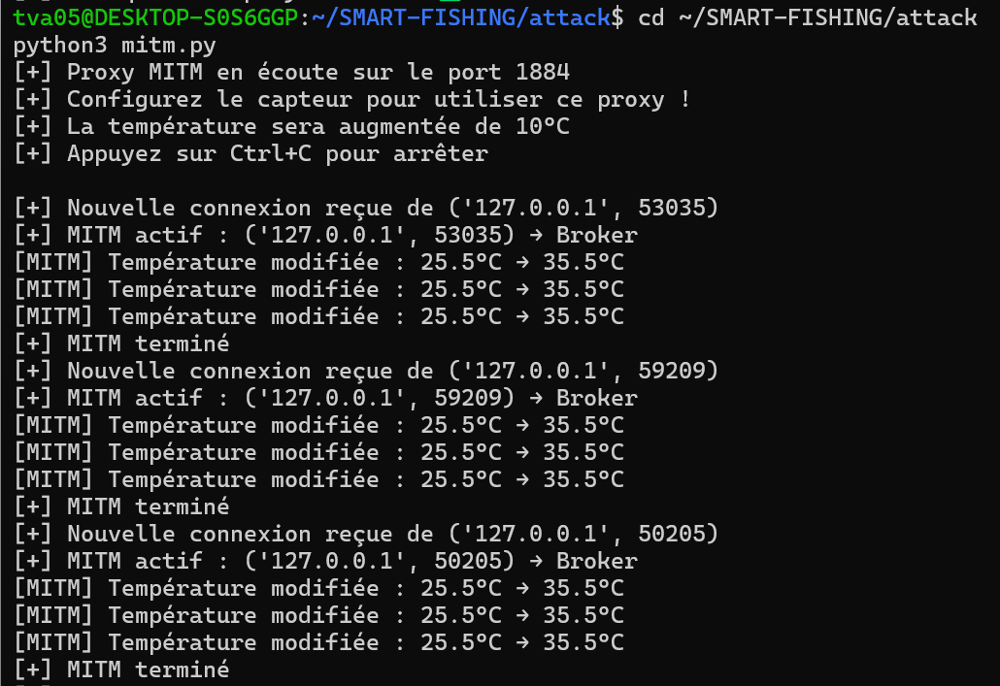

### Message publié
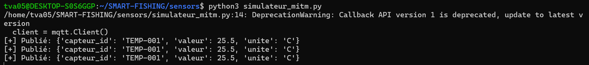

### Message modifié
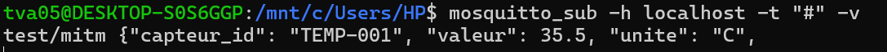

### Preuve

Preuve (Proxy MITM)
text
[+] Proxy MITM en écoute sur le port 1884
[+] Nouvelle connexion reçue de ('127.0.0.1', 53035)
[MITM] Température modifiée : 25.5°C → 35.5°C
[MITM] Température modifiée : 25.5°C → 35.5°C
Preuve (Superviseur)
text
test/mitm {"capteur_id": "TEMP-001", "valeur": 35.5, "unite": "C"}

### Impact

Modification en temps réel des données
Sabotage des informations
Détournement des alertes de sécurité
Prise de décision basée sur des données falsifiées

-------------------------------------------------------------------------------------------------------------------

## 5. SYNTHÈSE DES ATTAQUES

| # | Attaque | Script | Statut | Impact |
|---|---------|--------|--------|--------|
| 1 | Sniffing | `attack/sniffing.py` | ✅ | Espionnage |
| 2 | Spoofing | `attack/spoofing.py` | ✅ | Fausses données |
| 3 | Replay | `attack/replay.py` | ✅ | Falsification |
| 4 | MITM | `attack/mitm.py` | ✅ | Modification |

-------------------------------------------------------------------------------------------------------------------

## 6. CONTRE-MESURES

| Attaque | Contre-mesure |
|---------|---------------|
| Sniffing | TLS sur le broker (port 8883) |
| Spoofing | Authentification forte + certificats X.509 |
| Replay | Nonces ou timestamps |
| MITM | TLS + authentification mutuelle |
